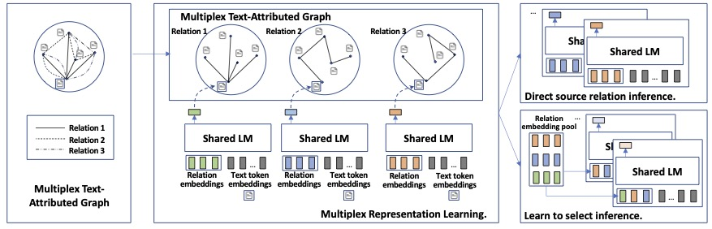

# METAG: Learning Multiplex Representations on Text-Attributed Graphs with One Language Model Encoder

This repository contains the source code and datasets for [Learning Multiplex Representations on Text-Attributed Graphs with One Language Model Encoder](https://arxiv.org/pdf/2310.06684v1.pdf), published in NeurIPs 2023 (GFrontiers).

## Links

- [Requirements](#requirements)
- [Overview](#overview)
- [Data](#edge-representation-learning-edgeformer-e)
- [Multiplex Representation Learning with METAG](#multiplex-representation-learning-with-metag)
- [Downstream Task Inference](#downstream-task-inference)
- [Citations](#citations)

## Requirements

The code is written in Python 3.8. Before running, you need to first install the required packages by typing following commands (Using a virtual environment is recommended):

```
pip3 install -r requirements.txt
```

## Overview
**METAG** contains one language model encoder to learn multiplex representations for nodes on text-attributed graphs.

<!-- </img> -->
<p align="center">
  
</p>

## Data

### Processed Data
You can directly download the processed datasets [here](https://drive.google.com/drive/folders/1_AGR5RQSC5CsCkWYMINNc9aisKK7uTQs?usp=sharing) without conducting the following steps.

### Raw Data
MAG data and Amazon data can be downloaded here: [MAG Link](https://zenodo.org/record/7611544#.ZFprI-zMJ3k) and [Amazon Link](https://nijianmo.github.io/amazon/index.html).

### Representation learning
1. Run the cells in ```tools/generate_data_{mag/amazon}.ipynb``` to generate sampled data for relation representation learning.
2. Run ```src/scripts/prepare_data.sh``` to obtain processed data (random sample and split into train/val/test).

### Downstream tasks
1. Run the cells in ```tools/generate_downstream_{mag/amazon}.ipynb``` to generate data for downstream tasks.


## Multiplex Representation Learning with METAG
Train:
```
cd src/
bash run_train_{MAG/amazon}.sh
```
Test:
```
bash run_test_group_{MAG/amazon}.sh
```

## Downstream Task Inference

### Direct source relation inference
```
bash downstream_match_test_zeroshot.sh
```

### Learn to select source relation inference
```
bash downstream_{class/regression/match}_train.sh
bash downstream_{class/regression/match}_test.sh
```

## Citations

Please cite the following paper if you find the code helpful for your research.
```
@article{jin2023learning,
  title={Learning Multiplex Embeddings on Text-rich Networks with One Text Encoder},
  author={Jin, Bowen and Zhang, Wentao and Zhang, Yu and Meng, Yu and Zhao, Han and Han, Jiawei},
  journal={arXiv preprint arXiv:2310.06684},
  year={2023}
}
```
